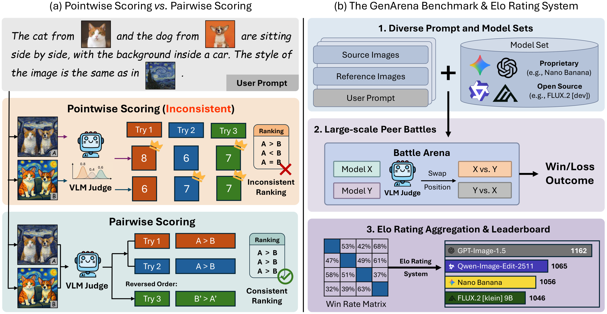
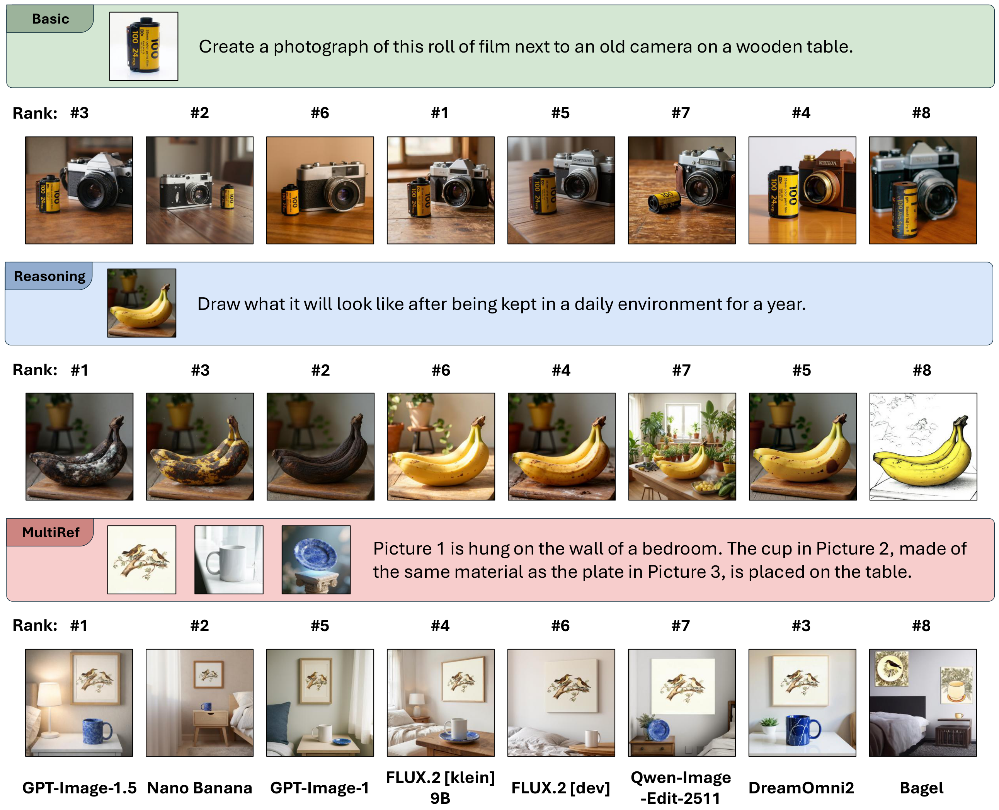

# GenArena

A unified evaluation framework for visual generation tasks using VLM-based pairwise comparison and Elo ranking.

[](https://arxiv.org/abs/2602.06013)
[](https://genarena.github.io)
[](https://huggingface.co/spaces/genarena/leaderboard)
[](https://huggingface.co/datasets/rhli/genarena)


## Abstract

The rapid advancement of visual generation models has outpaced traditional evaluation approaches, necessitating the adoption of Vision-Language Models as surrogate judges. In this work, we systematically investigate the reliability of the prevailing absolute pointwise scoring standard, across a wide spectrum of visual generation tasks. Our analysis reveals that this paradigm is limited due to stochastic inconsistency and poor alignment with human perception. To resolve these limitations, we introduce **GenArena**, a unified evaluation framework that leverages a *pairwise comparison* paradigm to ensure stable and human-aligned evaluation. Crucially, our experiments uncover a transformative finding that simply adopting this pairwise protocol enables off-the-shelf open-source models to outperform top-tier proprietary models. Notably, our method boosts evaluation accuracy by over 20% and achieves a Spearman correlation of 0.86 with the authoritative LMArena leaderboard, drastically surpassing the 0.36 correlation of pointwise methods. Based on GenArena, we benchmark state-of-the-art visual generation models across diverse tasks, providing the community with a rigorous and automated evaluation standard for visual generation.



## Quick Start

### Installation

```bash
pip install genarena
```

Or install from source:

```bash
git clone https://github.com/ruihanglix/genarena.git
cd genarena
pip install -e .
```

### Initialize Arena

Download benchmark data and official arena data with one command:

```bash
genarena init --arena_dir ./arena --data_dir ./data
```

This downloads:
- Benchmark Parquet data from `rhli/genarena` (HuggingFace)
- Official arena data (model outputs + battle logs) from `rhli/genarena-battlefield`

### Environment Setup

Set your VLM API credentials:

```bash
export OPENAI_API_KEY="your-api-key"
export OPENAI_BASE_URL="https://api.example.com/v1"
```

For multi-endpoint support (load balancing and failover), use comma-separated values:

```bash
export OPENAI_BASE_URLS="https://api1.example.com/v1,https://api2.example.com/v1"
export OPENAI_API_KEYS="key1,key2,key3"
```

### Run Evaluation

```bash
genarena run --arena_dir ./arena --data_dir ./data
```

### View Leaderboard

```bash
genarena leaderboard --arena_dir ./arena --subset basic
```

### Check Status

```bash
genarena status --arena_dir ./arena --data_dir ./data
```

## Running Your Own Experiments

### Directory Structure

To add your own model for evaluation, organize outputs in the following structure:

```
arena_dir/
└── <subset>/
    └── models/
        └── <GithubID>_<modelName>_<yyyymmdd>/
            └── <model_name>/
                ├── 000000.png
                ├── 000001.png
                └── ...
```

For example:
```
arena/basic/models/johndoe_MyNewModel_20260205/MyNewModel/
```

### Generate Images with Diffgentor

Use [Diffgentor](https://github.com/ruihanglix/diffgentor) to batch generate images for evaluation:

```bash
# Download benchmark data
hf download rhli/genarena --repo-type dataset --local-dir ./data

# Generate images with your model
diffgentor edit --backend diffusers \
    --model_name YourModel \
    --input ./data/basic/ \
    --output_dir ./arena/basic/models/yourname_YourModel_20260205/YourModel/
```

### Run Battles for New Models

```bash
genarena run --arena_dir ./arena --data_dir ./data \
    --subset basic \
    --exp_name yourname_YourModel_20260205
```

GenArena automatically detects new models and schedules battles against existing models.

## Submit to Official Leaderboard

> **Coming Soon**: The `genarena submit` command will allow you to submit your evaluation results to the official GenArena leaderboard via GitHub PR.

The workflow will be:
1. Run evaluation locally with `genarena run`
2. Upload results to your HuggingFace repository
3. Submit via `genarena submit` which creates a PR for review

## Documentation

| Document | Description |
|----------|-------------|
| [Quick Start](./docs/quickstart.md) | Installation and basic usage guide |
| [Architecture](./docs/architecture.md) | System design and key concepts |
| [CLI Reference](./docs/cli-reference.md) | Complete command-line interface documentation |
| [Experiment Management](./docs/experiments.md) | How to organize and manage experiments |
| [FAQ](./docs/faq.md) | Frequently asked questions |


## Citation

```bibtex
@misc{li2026genarenaachievehumanalignedevaluation,
      title={GenArena: How Can We Achieve Human-Aligned Evaluation for Visual Generation Tasks?},
      author={Ruihang Li and Leigang Qu and Jingxu Zhang and Dongnan Gui and Mengde Xu and Xiaosong Zhang and Han Hu and Wenjie Wang and Jiaqi Wang},
      year={2026},
      eprint={2602.06013},
      archivePrefix={arXiv},
      primaryClass={cs.CV},
      url={https://arxiv.org/abs/2602.06013},
}
```



## License

Apache License 2.0
